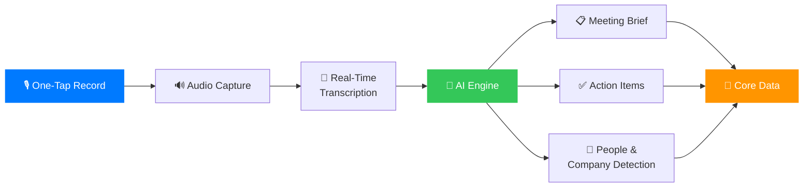
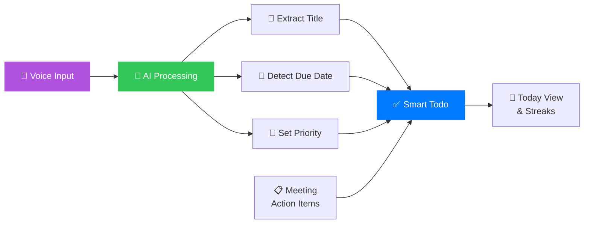
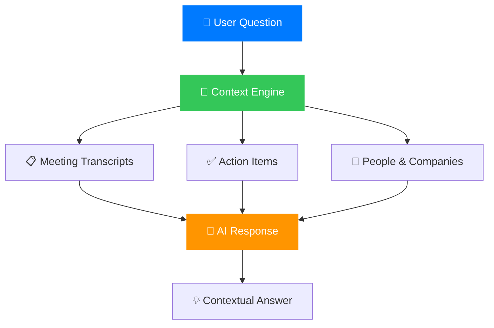
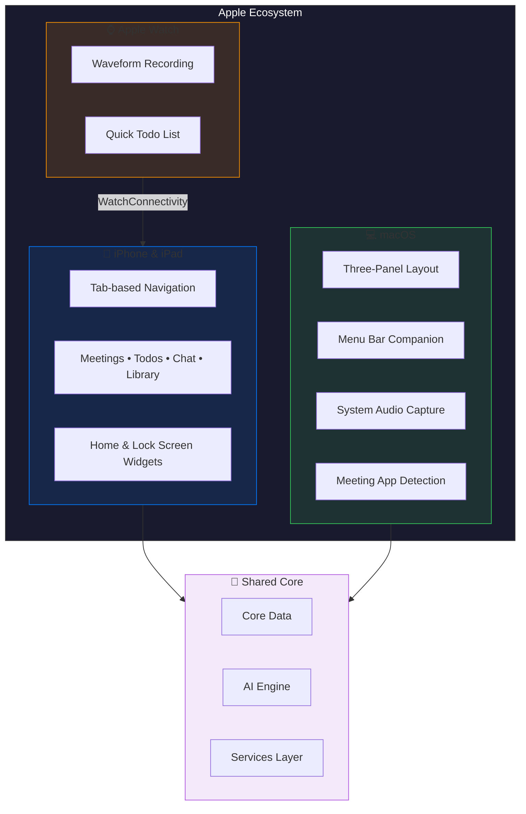
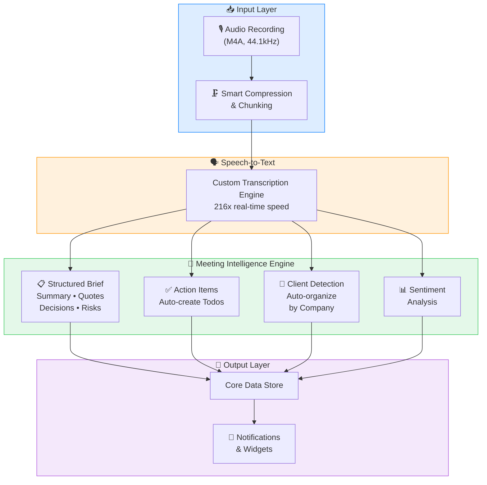
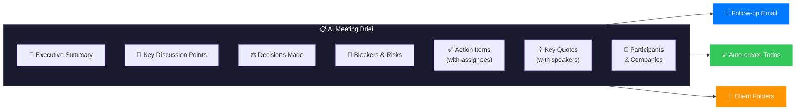
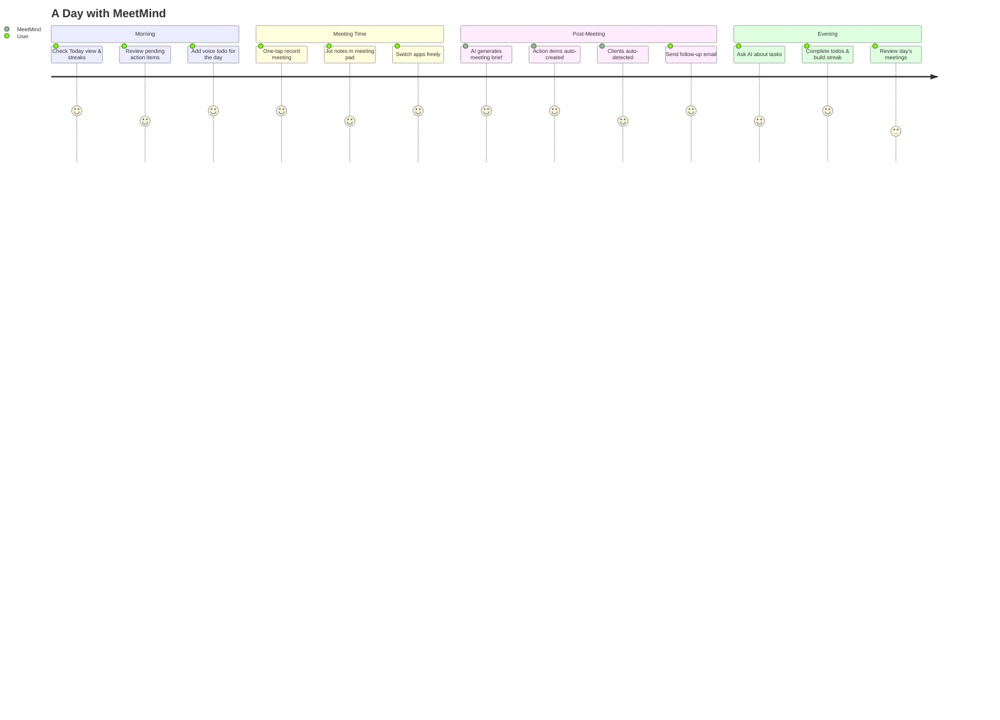
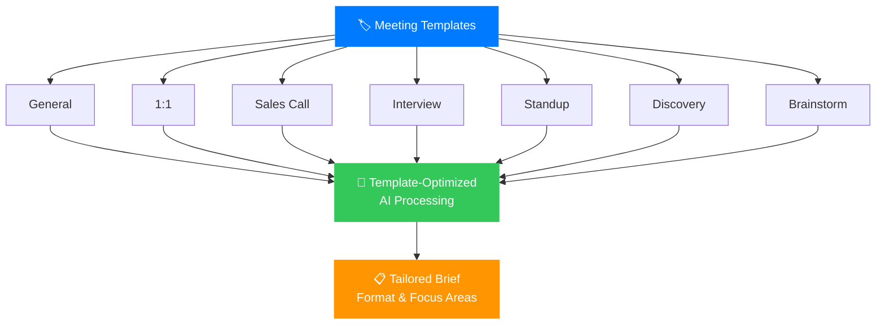

# MeetMind

**AI-Powered Meeting Intelligence & Smart Todo App for iOS, macOS & Apple Watch**

MeetMind is a personal productivity app that records your meetings, generates AI-powered summaries, tracks action items, and manages voice-first todos — all without a bot joining your call.

Built natively with SwiftUI for iPhone, Mac, and Apple Watch.

---

## Problem Statement

Professionals who spend significant time in meetings face two recurring pain points:

1. **Meeting chaos** — conversations go unrecorded, notes are scattered across tools, and action items fall through the cracks. By the time you sit down to write follow-up notes, half the details are gone.

2. **Todo fragmentation** — tasks captured in the moment lack structure, context, and follow-through. Voice memos sit unprocessed, sticky notes get lost, and nothing connects back to the meeting where the task originated.

Existing solutions either require bots to join your call, are web-first and desktop-only, or charge $14-18/month. None offer a truly mobile-native, bot-free experience with smart todo management built in.

**MeetMind solves both problems in one app** — record from your phone's microphone, get AI-generated briefs in seconds, and have action items automatically flow into your task list.

---

## How It Works

### Meeting Recording Flow



### Smart Todo Flow



### AI Chat Flow



---

## Key Features

### Meeting Recording & Intelligence
- **One-tap recording** — tap the mic button, start recording instantly
- **Bot-free** — records via device microphone; no bot joins your Zoom, Meet, or Teams call
- **Background recording** — switch apps freely during calls, recording continues
- **In-meeting notepad** — scratchpad to jot rough notes during the call; AI enhances them post-meeting
- **Real-time transcription** — proprietary speech-to-text engine with 216x real-time speed
- **AI meeting briefs** — structured summaries with executive summary, key discussion points, decisions, blockers, risks, and action items
- **Key quotes extraction** with speaker attribution
- **Client & company auto-detection** — automatically identifies participants and organizations from conversation context
- **Meeting templates** — General, 1:1, Sales Call, Interview, Standup, Discovery, Brainstorm
- **Follow-up email generation** — one-click professional email drafted from meeting brief
- **Meeting Recipes** — 6 built-in AI prompt templates (Coach me, Prep me, Write a brief, etc.)
- **3-hour recording limit** with warning at 2h 45m
- **Smart compression** — large audio files are automatically optimized and chunked for processing

### Smart Todo System
- **Voice todos** — speak your task, AI extracts title + due date + priority automatically
- **Natural language dates** — "Send report by Friday" detects the date
- **Recurring tasks** — daily, weekdays, weekly, monthly
- **Inline voice capture** — record directly from the floating action bar
- **Auto-create from meetings** — action items marked as yours become todos automatically
- **Todo notes** — tap any task to add detailed notes
- **Calendar history** — track completed tasks over time
- **Today view** — focused daily task list with streaks

### AI Chat
- **Ask about meetings** — "What action items are on me?" "What did the customer ask?"
- **Cross-meeting search** — "How many tasks are related to this project?"
- **Per-meeting chat** — ask questions about a specific meeting's content
- **Context-aware** — AI knows your tasks, clients, and priorities

### Organization & Search
- **Client folders** — auto-detected from meeting transcripts, color-coded
- **People view** — everyone you've met with, meeting history per person
- **Company view** — organize by company with all participants and meetings
- **Global search** — full-text across meetings, transcripts, action items, and people
- **Action item tracker** — cross-meeting view with filters (mine/others, pending/done)
- **Spaces** — custom workspaces to group related meetings

---

## Platform Experience

### Multi-Platform Architecture



### macOS Desktop App
- **Three-panel layout** — icon rail (dark sidebar) + meeting list + detail panel
- **Menu bar companion** — quick-record and recent meetings from the menu bar
- **System audio capture** — record system audio directly on macOS
- **Meeting app detection** — auto-detects active video conferencing apps (Zoom, Meet, Teams, etc.)
- **Native macOS design** — purpose-built for desktop, not an iPad port

### iOS Widgets
- **Quick Record** (small) — one-tap recording from Home Screen
- **Quick Todo** (small) — voice or text todo capture
- **Today's Tasks** (medium/large) — pending tasks, meeting count, stats
- **Lock Screen** — circular mic icon for instant recording access

### Apple Watch
- **Recording view** with waveform visualization and timer
- **Todo list** with tap-to-complete
- **WatchConnectivity** for syncing with iPhone

---

## Architecture

### Tech Stack

| Component | Technology |
|-----------|-----------|
| **UI** | SwiftUI (iOS 17+ / macOS 14+) |
| **Data** | Core Data (CloudKit-ready) |
| **AI Engine** | MeetMind Proprietary AI Pipeline |
| **Speech-to-Text** | Custom transcription engine (optimized for meetings) |
| **Intelligence** | Fine-tuned language model for meeting summarization |
| **Audio** | AVFoundation (M4A, 44.1kHz, mono, 128kbps) |
| **macOS Audio** | ScreenCaptureKit (system audio capture) |
| **Auth** | Firebase Auth + Google Sign-In |
| **Widgets** | WidgetKit + App Intents |
| **Watch** | WatchConnectivity |
| **Storage** | Keychain, UserDefaults, Documents dir |
| **Background** | BGTaskScheduler, audio background mode |

### AI Pipeline



### Meeting Brief Structure



---

## User Journey



---

## Meeting Templates



---

## Meeting Recipes

| Recipe | What It Does |
|--------|-------------|
| **Coach Me** | Get AI coaching feedback on your meeting performance |
| **Prep Me** | Generate a preparation brief before your next meeting |
| **Write a Brief** | Create a polished, shareable meeting summary |
| **Draft Follow-up** | Auto-generate a professional follow-up email |
| **Extract Tasks** | Pull all action items into a structured list |
| **Analyze Sentiment** | Understand the tone and dynamics of the conversation |

---

## Project Structure

```
MeetMind/
├── App/                        # App entry point, tab navigation
├── Core/                       # Shared components
├── Data/                       # Core Data models, persistence
├── DesignSystem/               # Colors (MMColors), typography, reusable components
├── Features/
│   ├── Meetings/               # Recording, briefs, detail view, templates, coaching
│   ├── Todos/                  # Voice/text capture, today view, calendar history
│   ├── Notes/                  # Quick notes with voice dictation
│   ├── Library/                # Client folders, insights, dictionary
│   ├── Chat/                   # AI chat with meeting context
│   ├── People/                 # People & company tracking
│   ├── Recipes/                # Meeting AI recipes (coach, prep, brief, etc.)
│   ├── ActionItems/            # Cross-meeting action item tracker
│   ├── Search/                 # Global search
│   ├── Settings/               # Configuration, storage, export, stats
│   ├── Auth/                   # Sign-in, profile setup
│   └── Spaces/                 # Custom workspaces
├── MacApp/                     # macOS-specific app
│   ├── MeetMindMacApp.swift    # macOS entry point with menu bar extra
│   ├── MacMainView.swift       # Three-panel layout
│   ├── MenuBarView.swift       # Menu bar companion
│   ├── SystemAudioCapture.swift # System audio integration
│   ├── MeetingAppDetector.swift # Auto-detect video conferencing apps
│   └── Views/                  # Mac-specific views (list, detail, todos, etc.)
├── Services/                   # Business logic & AI pipeline
│   ├── MeetingPipeline.swift   # End-to-end recording → brief pipeline
│   ├── AudioRecordingService.swift
│   ├── MeetingService.swift    # Meeting CRUD + processing
│   ├── TodoService.swift       # Todo management
│   ├── VoiceDictationService.swift
│   ├── CalendarService.swift   # EventKit integration
│   ├── AuthService.swift       # Authentication
│   ├── LLM/                    # AI engine integration layer
│   └── ...                     # Analytics, export, sentiment, coaching, etc.
├── Widgets/                    # Widget data models, app intents
├── WatchApp/                   # Apple Watch views + connectivity
└── Resources/                  # Info.plist, assets, entitlements
```

---

## Setup

### Prerequisites
- Xcode 15+
- iOS 17+ device or simulator / macOS 14+

### Quick Start

1. **Clone the repo:**
```bash
git clone https://github.com/gauravmodi09/MeetMind.git
cd MeetMind
```

2. **Configure AI Engine** — create `MeetMind/Resources/Secrets.plist` with your API credentials:
```xml
<?xml version="1.0" encoding="UTF-8"?>
<!DOCTYPE plist PUBLIC "-//Apple//DTD PLIST 1.0//EN"
  "http://www.apple.com/DTDs/PropertyList-1.0.dtd">
<plist version="1.0">
<dict>
    <key>GROQ_API_KEY</key>
    <string>your-api-key-here</string>
</dict>
</plist>
```

3. **Open in Xcode:**
```bash
open MeetMind.xcodeproj
```

4. **Run:**
   - **iOS:** Select an iPhone simulator or device → `Cmd+R`
   - **macOS:** Select "My Mac" as destination → `Cmd+R`

---

## Platform Support

| Platform | Status | Min Version |
|----------|--------|-------------|
| **iPhone** | Full support | iOS 17.0 |
| **iPad** | Full support | iPadOS 17.0 |
| **Mac** | Native app (not Catalyst) | macOS 14.0 |
| **Apple Watch** | Companion app | watchOS 10.0 |

---

## What Makes MeetMind Different

| Capability | MeetMind | Typical Competitors |
|------------|:--------:|:-------------------:|
| Bot-free recording | ✓ | Most require bots |
| iPhone + Mac native | ✓ | Web-first or single platform |
| Apple Watch | ✓ | ✗ |
| iOS Home & Lock Screen widgets | ✓ | ✗ |
| Smart todo system | ✓ | ✗ |
| Voice todo capture | ✓ | ✗ |
| In-meeting notepad | ✓ | Rare |
| AI meeting recipes | ✓ | Rare |
| System audio capture (Mac) | ✓ | Rare |
| Menu bar companion | ✓ | Some |
| Free for personal use | ✓ | $14-18/month |

---

## License

Private repository. All rights reserved.

---

*Built with SwiftUI and a relentless focus on making meetings useful.*
